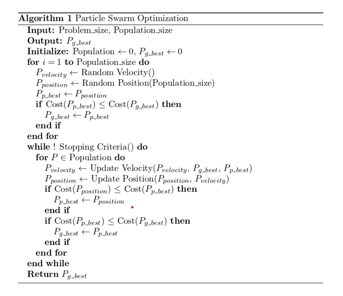
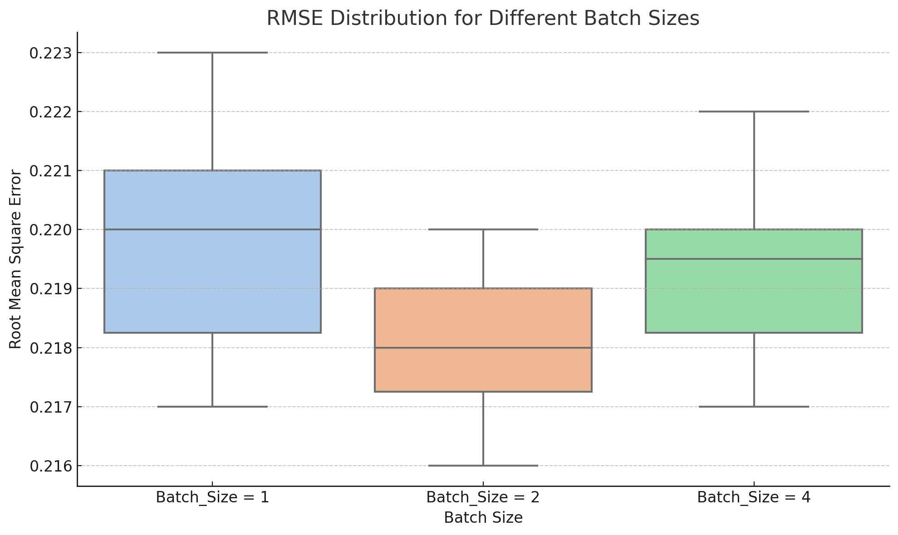
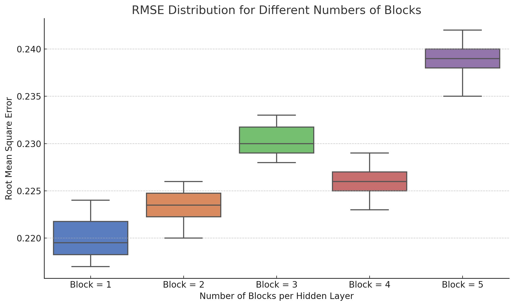
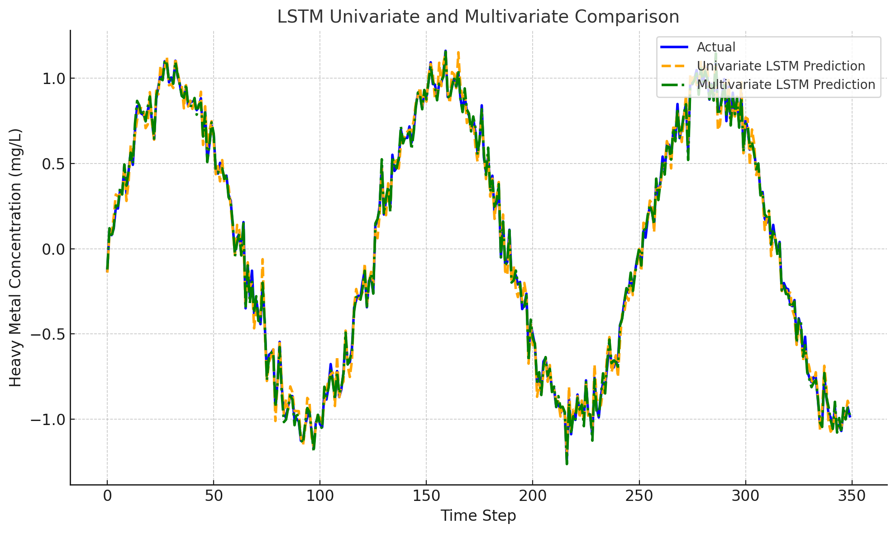
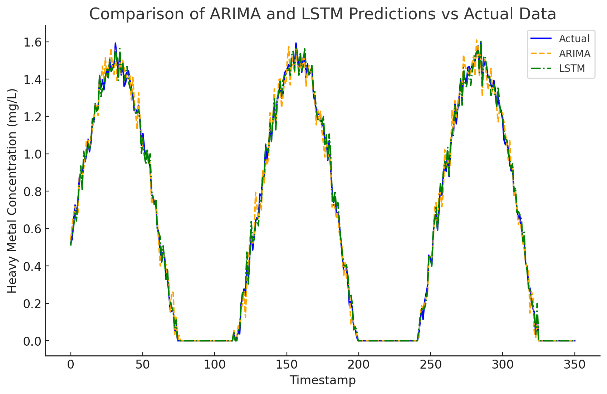

# Time Series Analysis Using Machine Learning

## Project Overview
This repository contains the code and data for a time series forecasting project aimed at predicting heavy metal concentrations in industrial wastewater. The study combines machine learning and statistical modeling techniques, including ARIMA (AutoRegressive Integrated Moving Average) and PSO-LSTM (Particle Swarm Optimization - Long Short-Term Memory), to accurately forecast heavy metal levels based on input features such as pH, chemical dosage, redox potential, and conductivity.

The goal of this project is to develop robust predictive models to optimize wastewater treatment processes, enabling better control of heavy metal removal and improving overall operational efficiency.

## Models Implemented
### 1. **ARIMA (AutoRegressive Integrated Moving Average)**
   - Utilized to model and forecast the heavy metal concentration time series.
   - The ARIMA model was tuned using grid search for optimal parameters (p, d, q) to capture the underlying trend, seasonality, an residual components.
   - Suitable for understanding the temporal dependencies in the data.

### 2. **PSO-LSTM (Particle Swarm Optimization - Long Short-Term Memory)**
   - A hybrid model combining LSTM networks for capturing long-term dependencies in time series data and PSO for optimizing model hyperparameters.
   - Features such as pH, chemical dosage, redox potential, and conductivity were used as input variables to predict future concentrations of heavy metals.
   - The PSO algorithm helps to find optimal hyperparameters, including learning rate, number of neurons, and dropout rate, to improve the LSTM's performance.

## Repository Structure
      time-series-forecasting/
      ├── data/                          # Data folder for raw and preprocessed datasets
      │   ├── heavy_metal_data.xlsx      # Raw dataset of heavy metal concentrations
      │   └── processed_data.csv         # Preprocessed data for modeling
      ├── scripts/                       # Scripts for data preprocessing, modeling, and evaluation
      │   ├── arima_model.py             # Script for ARIMA time series forecasting
      │   ├── pso_lstm_model.py          # Script for PSO-LSTM model training
      │   ├── data_preprocessing.py      # Script for cleaning and preprocessing data
      │   └── hyperparameter_optimization.py # Script for optimizing hyperparameters
      ├── models/                        # Folder for saving trained models
      │   ├── arima_model.pkl            # Saved ARIMA model
      │   └── pso_lstm_model.h5          # Trained PSO-LSTM model
      ├── results/                       # Results like plots, metrics, and logs
      │   ├── arima_forecast_plot.png    # Visualization of ARIMA forecast
      │   ├── pso_lstm_loss_curve.png    # Loss curve for PSO-LSTM training
      │   ├── heavy_metal_prediction.png # Plot comparing predicted vs actual concentrations
      │   └── metrics.txt                # Performance metrics (e.g., MSE, MAE)
      ├── requirements.txt               # Python dependencies
      └── README.md                      # Project overview and instructions

## How to Run the Code
1. Clone the repository:
   - `git clone https://github.com/yasirusama61/Time-Series-Analysis.git`
   - `cd Time-Series-Analysis`
  
2. Install the required dependencies:
   - `pip install -r requirements.txt`

3. Data Preprocessing:
   - `python scripts/data_preprocessing.py`

3. Train the ARIMA model:
   - `python arima_model.py`
   
4.  Train the PSO-LSTM model:
   - `python PSO-LSTM.py`

5. Hyperparameter Optimization
   - `python scripts/hyperparameter_optimization.py`

## Data
The data used in this project was provided by the third and consists of industrial wastewater records. The dataset includes features such as:

   - Heavy Metal Concentration (mg/L)
   - Heavy Metal Input Concentration (mg/L)
   - Electrical Conductivity
   - pH
   - pH_ORP (Oxidation-Reduction Potential)
   - Chemical Dosage Levels (Chemical A and B)

The original dataset is stored in the `data/heavy_metal_data.xlsx` file, and preprocessed data can be found in `data/processed_data.csv`.

### Optimization Techniques

#### Particle Swarm Optimization (PSO)

PSO is a population-based optimization algorithm inspired by the social behavior of bird flocking or fish schooling. In PSO, each particle represents a potential solution and adjusts its position based on its own experience and that of neighboring particles.

### Algorithm: Particle Swarm Optimization

## Evaluation Metrics

The models are evaluated using the following metrics:
   - Mean Squared Error (MSE)
   - Mean Absolute Error (MAE)
   - Mean Squared Logarithmic Error (MSLE)
   - R-Squared (R²)

## Results
Results, including performance metrics and plots, are stored in the `results/` folder:

   - **ARIMA Forecast**: Shows the model's ability to capture trends and seasonality.
   - **PSO-LSTM Performance**: Visualizations such as training loss curves and predicted vs. actual plots.
   - **Evaluation Metrics**: A file summarizing the MSE, MAE, and R² scores for both models.
   - **Sensitivity Analysis**: A plot showing the influential parameters identified through sensitivity analysis.
   - **Batch Size Tuning**: Shows the effect of different batch sizes on RMSE.
   - **Block Number Tuning**: Illustrates the impact of varying the number of blocks in the hidden layer on RMSE.

## Hyperparameter Optimization

During the development of the LSTM model, hyperparameter tuning was performed to achieve the optimal settings for better prediction accuracy. The table below summarizes the optimal hyperparameter values used in the final model:

| Hyperparameters                     | Optimal Settings |
|-------------------------------------|------------------|
| Number of Epochs                    | 500              |
| Batch Size                          | 2                |
| Number of Blocks per Hidden Layer   | 1                |
| Dense Layer                         | 1                |
| Learning Rate                       | 0.1              |
| Dropout Ratio                       | 0.7              |
| Optimizer                           | Adam             |
| Activation Function                 | Hyperbolic Tangent|
| Training Loss                       | 0.0153           |
| Validation Loss                     | 0.0198           |

### LSTM Model Comparison

The figure below compares the predictions made by Univariate and Multivariate LSTM models against the actual heavy metal concentration.

### Sensitivity Analysis Plot

### ARIMA vs. LSTM Performance
In this project, both ARIMA (AutoRegressive Integrated Moving Average) and LSTM (Long Short-Term Memory) models were employed to forecast the heavy metal concentration in wastewater. The results were compared to evaluate the effectiveness of each model in time series forecasting:

- **ARIMA Model**: The ARIMA model demonstrated the capability to capture linear patterns in the time series data. It performed well for predicting the general trend and seasonality of the heavy metal concentration. However, ARIMA struggled with rapid fluctuations and non-linear relationships within the dataset, leading to some inaccuracies during sudden changes.

- **LSTM Model**: The LSTM model, with its ability to learn long-term dependencies and handle non-linear relationships, was better suited for capturing abrupt changes in heavy metal concentration. It provided more accurate predictions during periods of rapid change. However, the overall performance was similar to ARIMA in terms of capturing the main trend and seasonal variations.

- **Comparison Plot**: The plot below compares the predictions of ARIMA and LSTM against the actual heavy metal concentration values. Both models closely follow the actual trends, but LSTM shows a slight edge in accuracy, especially during rapid changes in concentration.

### Conclusion
While both models demonstrated similar overall accuracy, the LSTM model's ability to handle non-linear relationships and rapid changes in data makes it a slightly better choice for this time series forecasting task. The combination of ARIMA and LSTM can also be considered for future work to leverage the strengths of both models.

## License
This project is licensed under the MIT License - see the LICENSE file for details.
