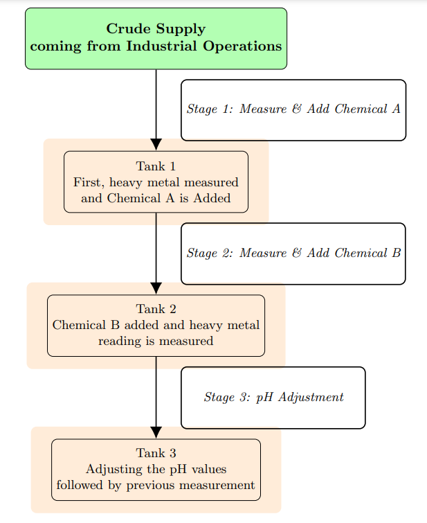
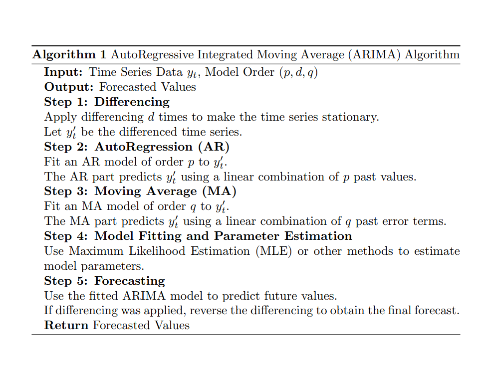
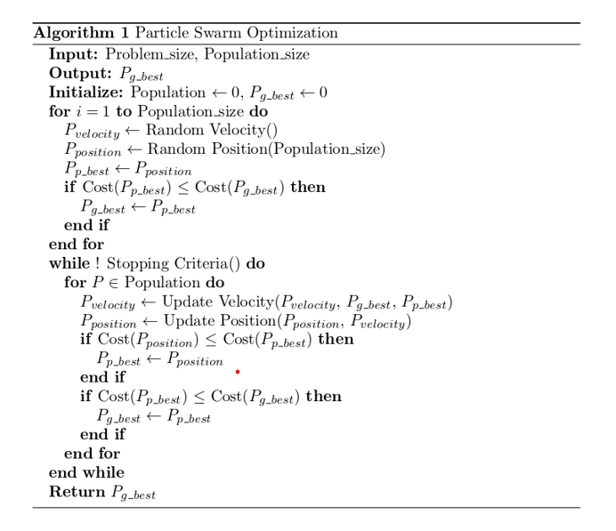
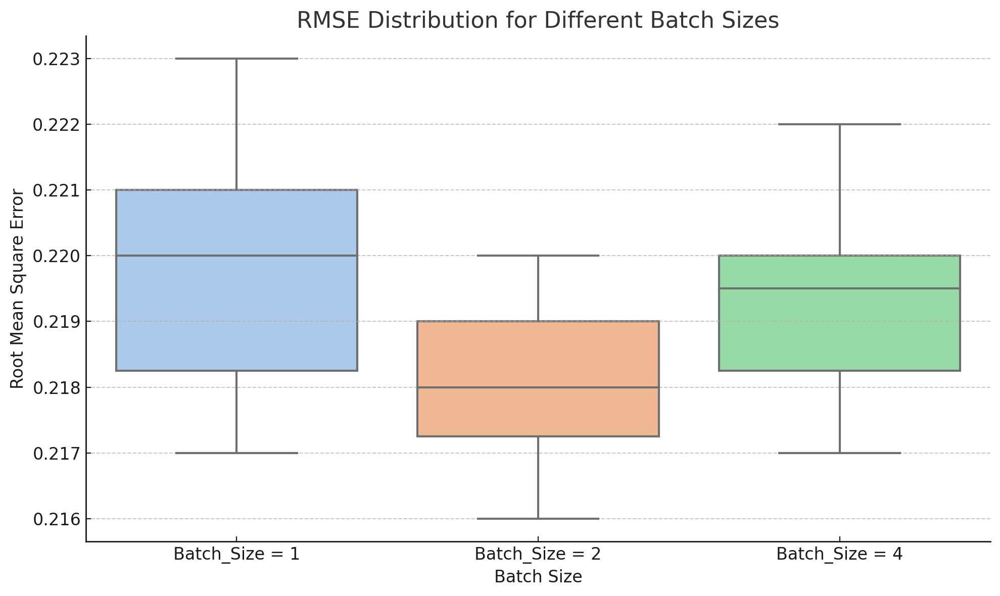
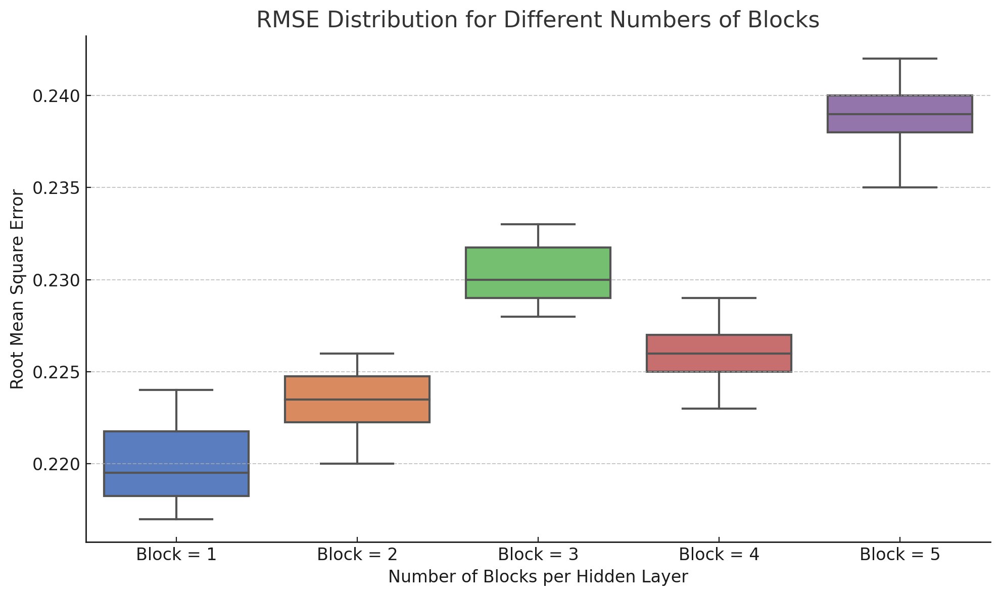
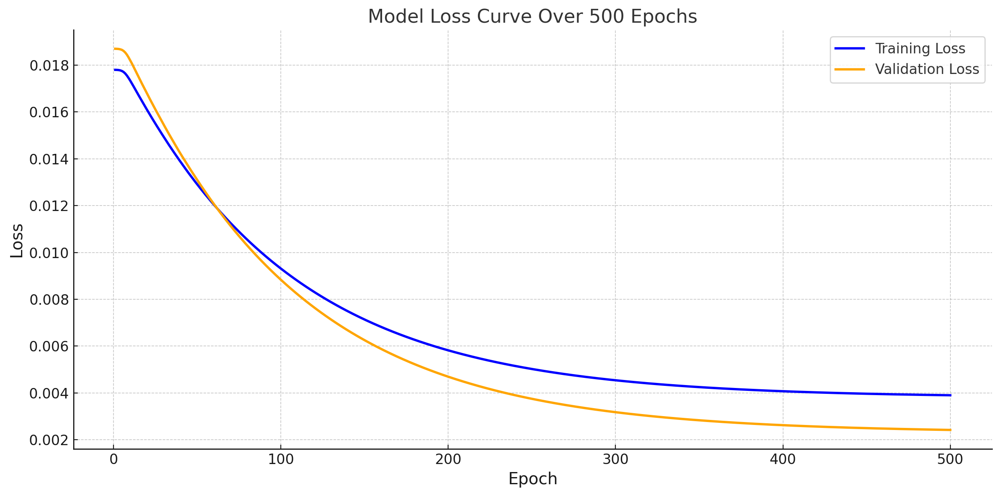
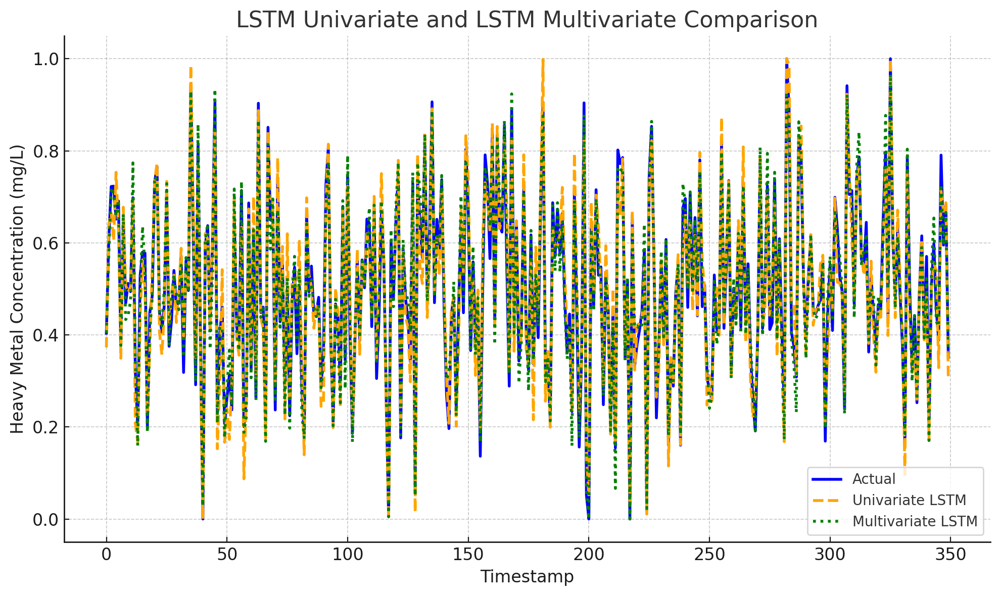
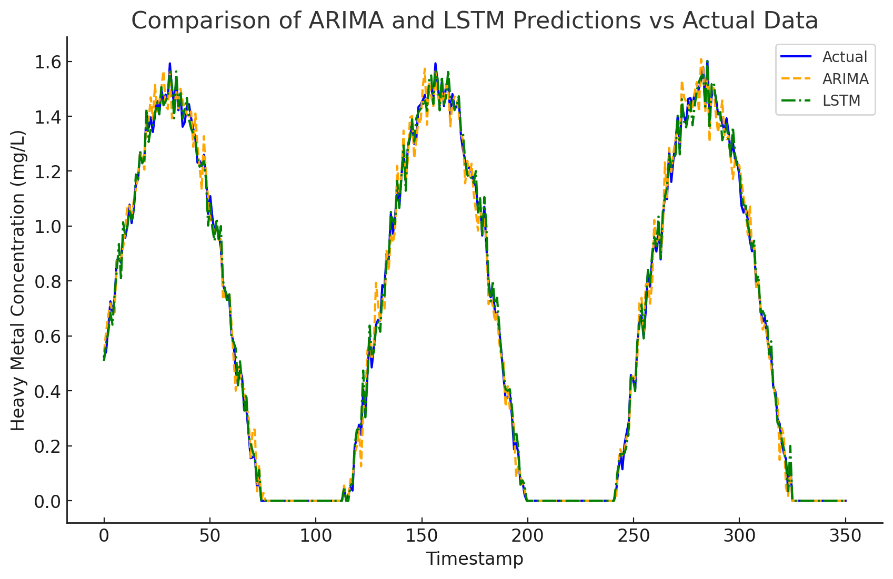
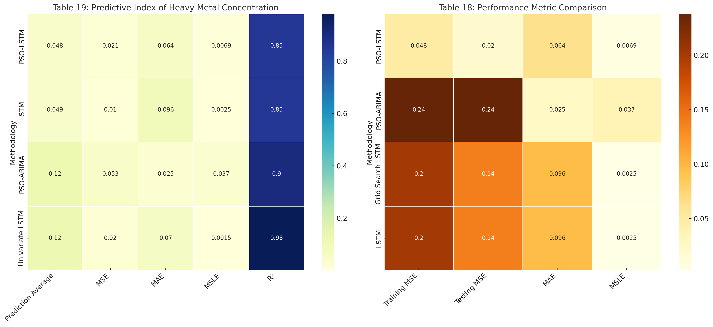
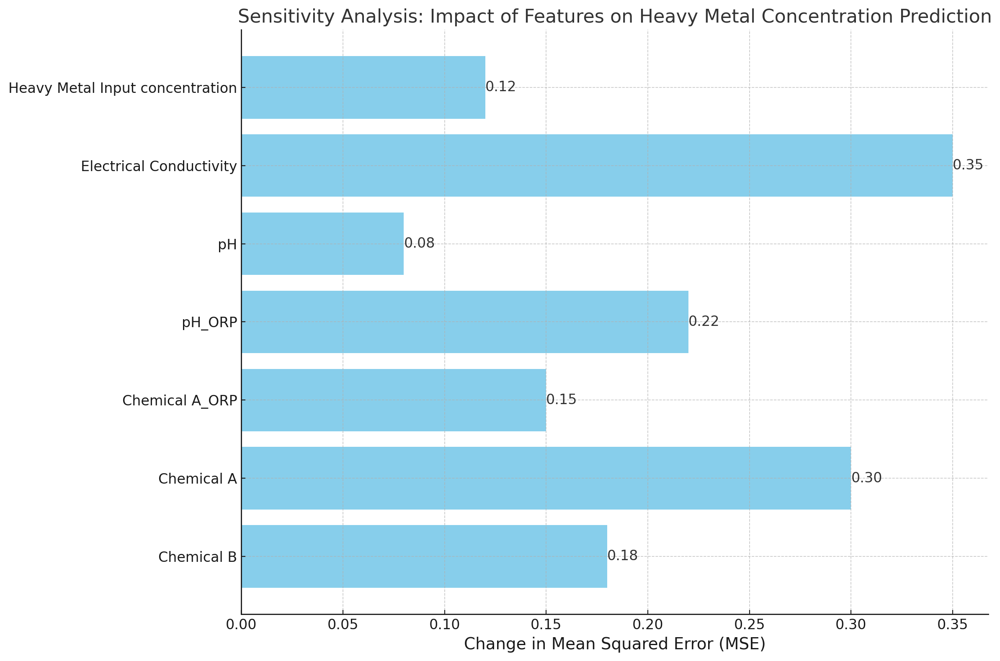

# 🌊 Time Series Analysis Using Machine Learning  

 
 
 
  

---

## 📌 Project Overview
This repository focuses on predicting **heavy metal concentrations** in industrial wastewater using **time series forecasting**. Models like **ARIMA** and **PSO-LSTM** combine statistical and machine learning techniques to:

- 🔍 Forecast heavy metal levels based on features like **pH**, **chemical dosage**, **redox potential**, and **conductivity**.  
- ⚙️ Optimize wastewater treatment for better efficiency and control.

### 🎯 Goal
Build reliable models to improve wastewater treatment processes and operational performance.

---

### 💡 Workflow
Stages of wastewater treatment and measurement:

---

## 🧠 Models Implemented

### 1. **ARIMA (AutoRegressive Integrated Moving Average)**
   - Forecasts heavy metal concentrations in wastewater.
   - Parameters (p, d, q) tuned via grid search.
   - Key steps:
     1. Identify parameters (p, d, q) using ACF and PACF plots.
     2. Make the series stationary (if needed).
     3. Fit the ARIMA model.
     4. Forecast future values.
     5. Evaluate performance (MSE, MAE).

   **Algorithm Overview**:

   

---

### 2. **PSO-LSTM (Particle Swarm Optimization - Long Short-Term Memory)**
   - Combines **LSTM** for long-term dependencies with **PSO** for hyperparameter optimization.
   - Input features: **pH**, **chemical dosage**, **redox potential**, and **conductivity**.
   - PSO optimizes key hyperparameters (learning rate, neurons, dropout rate) for better model performance.

## 📂 Repository Structure
      time-series-forecasting/
      ├── .github/                         # GitHub Actions workflows for CI/CD (if applicable)
      │   └── workflows/
      │       └── python-package.yml       # Workflow for testing and building Python packages
      ├── data/                            # Data folder for raw and preprocessed datasets
      │   ├── heavy_metal_data.xlsx        # Placeholder for raw dataset (not publicly available)
      │   └── processed_data.csv           # Preprocessed data used for modeling (not included)
      ├── scripts/                         # Scripts for data processing, modeling, and evaluation
      │   ├── arima_model.py               # Script for ARIMA time series forecasting
      │   ├── train_lstm.py                # Script for training LSTM model
      │   ├── pso_lstm_model.py            # Script for PSO-LSTM model training
      │   ├── hyperparameter_optimization.py # Script for optimizing hyperparameters using PSO
      │   ├── learning_rate_hidden_layer_tuning.py # Script for tuning LSTM hyperparameters
      │   ├── preprocess_data.py           # Script for data cleaning and preprocessing
      │   ├── sensitivity_analysis.py      # Script for sensitivity analysis
      │   ├── var.py                       # Script for Vector Autoregression (VAR) analysis
      │   ├── test.py                      # Unit tests for the project
      │   └── furniture_sales_arima.py     # Additional ARIMA example using sales data
      ├── models/                          # Folder for saving trained models
      │   ├── arima_model.pkl              # Saved ARIMA model
      │   └── pso_lstm_model.h5            # Trained PSO-LSTM model
      ├── results/                         # Results such as plots, metrics, pseudocode, and logs
      │   ├── ARIMA_algorithm.png          # Pseudocode for ARIMA
      │   ├── arima_vs_lstm_comparison.png # Plot comparing ARIMA and LSTM predictions
      │   ├── batch_size_rmse.png          # Plot showing effect of batch size on RMSE
      │   ├── block_number_rmse.png        # Plot illustrating block number tuning for RMSE
      │   ├── lstm_comparison.png          # LSTM model comparison plot
      │   ├── metrics.png                  # Heatmap of performance metrics (e.g., MSE, MAE, R²)
      │   ├── processflow.png              # Visualization of the process flow
      │   ├── pso_algorithm.png            # Pseudocode for PSO algorithm
      │   ├── pso_lstm_loss_curve.png      # Loss curve for PSO-LSTM training
      │   └── sensitivity_analysis_plot.png # Plot showing feature sensitivity analysis
      ├── notebooks/                       # Jupyter notebooks for analysis and documentation
      │   ├── Tune_the_parameters_of_SVM_using_PSO.ipynb # Notebook for PSO-SVM tuning
      │   └── other_notebooks.ipynb        # Other analysis or tutorial notebooks
      ├── README.md                        # Project overview and instructions
      ├── requirements.txt                 # Python dependencies
      └── LICENSE                          # License for the project (if applicable)

## ⚙️ How to Run the Code
1. Clone the repository:
   - `git clone https://github.com/yasirusama61/Time-Series-Analysis.git`
   - `cd Time-Series-Analysis`
  
2. Install the required dependencies:
   - `pip install -r requirements.txt`

3. Data Preprocessing:
   - `python scripts/data_preprocessing.py`

3. Train the ARIMA model:
   - `python arima_model.py`
   
4.  Train the PSO-LSTM model:
   - `python PSO-LSTM.py`

5. Hyperparameter Optimization
   - `python scripts/hyperparameter_optimization.py`

## 📊 Data

The data used in this project was collected from an industrial wastewater treatment facility in collaboration with a company specializing in environmental protection and energy-saving technologies. Due to confidentiality agreements, the original dataset cannot be publicly shared. However, the analysis conducted in this project utilized features such as:

   - Heavy Metal Concentration (mg/L)
   - Heavy Metal Input Concentration (mg/L)
   - Electrical Conductivity
   - pH
   - pH_ORP (Oxidation-Reduction Potential)
   - Chemical Dosage Levels (Chemical A and B)

For privacy reasons, certain sensitive details have been anonymized or modified in the dataset used for analysis. The original raw data is not included in the repository. Only code and scripts for data processing, model training, and evaluation are provided.

### 🛠️ Optimization Techniques

#### 🐦 Particle Swarm Optimization (PSO)
PSO is a population-based optimization algorithm inspired by the social behavior of birds or fish. Each particle represents a potential solution and adjusts its position based on its own experience and neighboring particles' performance.

**Algorithm Overview**:

---

## 📊 Evaluation Metrics
The models were evaluated using the following metrics:
- **Mean Squared Error (MSE)**
- **Mean Absolute Error (MAE)**
- **Mean Squared Logarithmic Error (MSLE)**
- **R-Squared (R²)**

---

## 📈 Results
Key results, including performance metrics and visualizations, are saved in the `results/` folder.

### Highlights:
- **ARIMA Forecast**: Demonstrates trends and seasonality predictions.
- **PSO-LSTM Performance**: Includes loss curves and predicted vs. actual plots.
- **Evaluation Metrics**: Summary of MSE, MAE, and R² for both models.
- **Sensitivity Analysis**: Highlights influential features affecting predictions.
- **Batch Size Tuning**: Displays the effect of batch sizes on RMSE.
- **Block Number Tuning**: Shows how hidden layer block counts impact RMSE.

---

### 🎛️ Hyperparameter Optimization

#### Optimized Hyperparameters for PSO-LSTM:

| Hyperparameter                     | Optimal Setting  |
|------------------------------------|------------------|
| **Number of Epochs**               | 500              |
| **Batch Size**                     | 2                |
| **Blocks per Hidden Layer**        | 1                |
| **Dense Layer**                    | 1                |
| **Learning Rate**                  | 0.1              |
| **Dropout Ratio**                  | 0.7              |
| **Optimizer**                      | Adam             |
| **Activation Function**            | Hyperbolic Tangent |
| **Training Loss**                  | 0.0153           |
| **Validation Loss**                | 0.0198           |

---

### 📉 Model Loss Curve
The plot below shows **Training** and **Validation Loss** over 500 epochs:

#### Key Insights:
- **Convergence:** Loss decreases sharply during initial epochs, indicating effective learning.
- **Stabilization:** Loss stabilizes after ~40 epochs, suggesting the model has converged.
- **Generalization:** Minimal gap between training and validation loss, indicating low overfitting.
- **Validation Trends:** Slight fluctuations in validation loss, but consistent overall.

---

### 🔍 LSTM Model Comparison
The plot below compares predictions from **Univariate** and **Multivariate LSTM models** against actual heavy metal concentrations:

---

### ⚔️ ARIMA vs. LSTM Performance

#### Key Observations:
- **ARIMA**:
  - Excels at capturing **linear trends** and **seasonality**.
  - Struggles with rapid fluctuations and non-linear relationships.
- **LSTM**:
  - Handles **non-linear dependencies** and **abrupt changes** better.
  - Slightly outperforms ARIMA during rapid concentration changes.

#### Comparison Plot:
The following plot compares ARIMA and LSTM predictions against actual values:

- **Conclusion:** Both models closely follow trends, but LSTM demonstrates an edge in handling rapid changes, making it more suitable for dynamic datasets.

# 📊 Performance Metrics

---

## 🔍 Predictive Index of Heavy Metal Concentration

| Methodology      | Prediction Average | Prediction MSE | Prediction MAE | Prediction MSLE | R²       |
|------------------|--------------------|----------------|----------------|-----------------|----------|
| **PSO-LSTM**     | 0.048              | 0.021          | 0.064          | 0.0069          | 85%      |
| **LSTM**         | 0.049              | 0.010          | 0.096          | 0.0025          | 85%      |
| **PSO-ARIMA**    | 0.125              | 0.053          | 0.025          | 0.0373          | 90%      |
| **Univariate LSTM** | 0.120           | 0.020          | 0.070          | 0.0015          | 98%      |

### ✨ Key Observations:
- **PSO-LSTM** and **LSTM** models exhibit comparable R² values of **85%**, showing similar ability to explain variance in the data. However, **LSTM** achieves a lower MSE, reflecting smaller average prediction errors.
- **PSO-ARIMA** performs better in terms of **R² (90%)**, but its higher MSE and MSLE suggest larger prediction errors, especially during abrupt changes.
- **Univariate LSTM** has the highest **R² (98%)**, indicating that it explains nearly all the variability in the data. It also achieves the lowest MSLE, making it the best performer in terms of logarithmic error.

---

## ⚖️ Performance Metric Comparison Across Methods

| Analytical Methods | Training MSE | Testing MSE | MAE   | MSLE   |
|--------------------|--------------|-------------|-------|--------|
| **PSO-LSTM**       | 0.048        | 0.020       | 0.064 | 0.0069 |
| **PSO-ARIMA**      | 0.238        | 0.238       | 0.025 | 0.0373 |
| **Grid Search**    | 0.203        | 0.139       | 0.096 | 0.0025 |
| **LSTM**           | 0.203        | 0.139       | 0.096 | 0.0025 |

### ✨ Key Observations:
- **PSO-LSTM** achieves the **lowest testing MSE (0.020)**, demonstrating its strong generalization capability to unseen data.
- **PSO-ARIMA** exhibits a significantly higher MSE in both training and testing, indicating possible overfitting or difficulty in handling complex data patterns.
- **Grid Search** and plain **LSTM models** show similar performance, with moderate testing MSE and MAE. Both models excel with the lowest MSLE, highlighting their effectiveness in minimizing relative errors.

---

### 📊 Performance Metric Comparison

## 🔍 Sensitivity Analysis

The plot below shows the impact of excluding each feature on the prediction of heavy metal concentrations, measured by changes in **Mean Squared Error (MSE)**:

---

### ✨ Insights

- **Key Influential Features**:
  - **Electrical Conductivity**: Highest impact with an MSE change of ~0.35, indicating it is a critical predictor strongly correlated with heavy metal concentrations.
  - **Chemical A**: Significant impact with an MSE change of ~0.30, highlighting its importance in influencing predictions.

- **Moderate Impact Features**:
  - **pH_ORP**: MSE change of ~0.22, reflecting a moderate contribution to the model’s performance.
  - **Chemical B**: MSE change of ~0.18, suggesting relevance but less impactful than top factors.

- **Less Influential Features**:
  - **Heavy Metal Input Concentration**: MSE change of ~0.12, contributing to predictions but with a smaller impact.
  - **pH**: Least impact with an MSE change of ~0.08, showing a minor role compared to other features.

---

### 🛠️ Recommendations

1. **Prioritize Key Features**:
   - Focus on monitoring and controlling **Electrical Conductivity** and **Chemical A** to improve predictive accuracy.

2. **Feature Engineering**:
   - Create interaction terms or derived features (e.g., Electrical Conductivity × pH_ORP) to capture complex relationships.

3. **Further Analysis**:
   - Investigate why features like **pH** and **Heavy Metal Input Concentration** have lower impacts, potentially uncovering additional process insights.

---

## 🧪 Conclusion

- **Model Comparison**:
  - LSTM handles non-linear relationships and abrupt changes better than ARIMA, making it more suitable for dynamic datasets.
  - ARIMA is effective for linear trends and seasonality but struggles with rapid fluctuations.

- **Sensitivity Analysis Insights**:
  - **Electrical Conductivity** and **Chemical A** are the most influential features.
  - Incorporating interaction terms or engineered features can further enhance predictions.

- **Future Work**:
  - Explore a hybrid ARIMA-LSTM model to combine the strengths of both approaches. ARIMA can handle trends and seasonality, while LSTM excels at capturing non-linear patterns and sudden changes.

---

## 🌟 Recommendations for Real-World Applications

### 1. **Real-Time Monitoring and Control**
   - Integrate the model with monitoring systems for dynamic adjustments to chemical dosage and flow rates.
   - Automate process adjustments to maintain compliance and optimize efficiency.

### 2. **Early Warning System**
   - Detect anomalies and spikes in heavy metal levels to prevent regulatory violations or equipment issues.
   - Proactively manage compliance thresholds with predictive alerts.

### 3. **Optimizing Chemical Usage**
   - Use predictions to optimize chemical dosages, reducing costs while maintaining target levels.
   - Focus on influential parameters like **Electrical Conductivity** to improve control.

### 4. **Scenario Analysis**
   - Simulate different operating conditions to evaluate treatment efficiency.
   - Predict the impact of system upgrades or process changes on performance.

### 5. **Deployment Considerations**
   - Retrain the model periodically with updated data to maintain accuracy.
   - Select deployment strategy:
     - **Cloud Deployment**: For centralized processing.
     - **Edge Deployment**: For low-latency local predictions.

---

## 📜 License
This project is licensed under the MIT License. See the `LICENSE` file for details.

---

## 🙏 Acknowledgments
This project was part of a master’s thesis conducted in collaboration with a leading environmental protection and energy-saving company. Special thanks to **Professor Huang Hao** of Yuan Ze University for guidance. The original dataset was modified to protect proprietary information, following recommendations from the project supervisor.